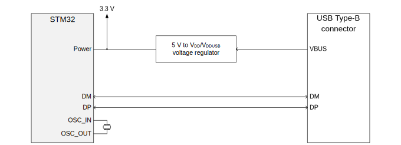

<h1>
	<center>Notice d'utilisation</center>
</h1>
<h3>
    <center>Ryan PERSÉE</center>
</h3>
<h4>
    <center>
        <p>
	        APP4 <br>
	        2021 - 2022
        </p>
    </center>
</h4>

---

# Matériel

## Description

Le firmware du microcontrôleur STM32 peut être flashé en utilisant soit une sonde de débogage (JTAG/SWD) soit une interface de bootloader (UART, USB DFU, I²C, SPI ou CAN). 

Cet utilitaire est conçu pour fonctionner avec l'interface de bootloader **USB DFU**.

On considère ici une carte de développement Nucleo-64 STM32 avec le MCU STM32F401RET6 (a.k.a. [Nucleo-F401RE](https://www.st.com/en/evaluation-tools/nucleo-f401re.html)).

## Ajouter un connecteur USB

```
    ⎡  upstream  ⇋ host  
MCU ⎢
    ⎣ downstream ⇋ peripheral
```




| Pin name | Function | Description    |
|----------|----------|----------------|
| PH0      | OSC_IN   |                |
| PH1      | OSC_OUT  |                |
| PA8      | FS_SOF   | Start Of Frame |
| PA9      | FS_VBUS  | Power          |
| PA10     | FS_ID    |                |
| PA11     | FS_DM    | Data+          |
| PA12     | FS_DP    | Data-          |

## Déclencher le bootloader

`Boot0(pin) = 1` et `Boot1(pin) = 0`.

## Références

* [\[ST\] Application Note - AN2606: STM32 microcontroller system memory boot mode](https://www.st.com/resource/en/application_note/cd00167594-stm32-microcontroller-system-memory-boot-mode-stmicroelectronics.pdf)
* [\[ST\] Datasheet - DS9716: STM32F401xB/C](https://www.st.com/resource/en/datasheet/stm32f401cb.pdf)
* [\[ST\] Reference Manual - RM0368: STM32F401xB/C and STM32F401xD/E](https://www.st.com/resource/en/reference_manual/dm00096844-stm32f401xb-c-and-stm32f401xd-e-advanced-arm-based-32-bit-mcus-stmicroelectronics.pdf)
* [\[ST\] Data Brief - DB3420: STM32CubeProgrammer all-in-one software tool 4.0](https://www.st.com/resource/en/data_brief/stm32cubeprog.pdf)
* [\[ST\] Application Note - AN4879: USB hardware and PCB guidelines using STM32 MCUs](https://www.st.com/resource/en/application_note/dm00296349-usb-hardware-and-pcb-guidelines-using-stm32-mcus-stmicroelectronics.pdf)

# Logiciel

## Backend Python : DFU API

> **Avancement** : fonctionnel.

### Description

Gestion des images et du flashage du microcontrôleur.

```
     ┌─/events	      [SSE*]  Évènements de dé/connexion USB
     ├─/devices	      [ GET]  Lister les périphériques connectés
API──┤  ├──/{serial}  [POST]  Flasher le firmware sur le MCU depuis une image
     │  └──/{serial}  [ GET]  Enregister le firmware du MCU dans une image
     └─/images	      [POST]  Uploader une image sur le serveur
		      [ GET]  Lister les images sur le serveur

*SSE : Server-Sent Events
```

### Installation

```bash
# (ubuntu) installer python 3.9
$ sudo apt install python3.9 python3.9-dev python3.9-venv

# créer un environnement
$ mkdir dfu-api/ && cd dfu-api/
$ python3.9 -m venv --prompt "dfu-api" venv/

# activer l'environnement
$ source ./venv/bin/activate

# installer wheel puis l'API
(dfu-api) $ python3.9 -m pip install wheel
(dfu-api) $ python3.9 -m pip install git+https://github.com/rpersee/pydfu.git
```

### Utilisation

```bash
# lancer le serveur Web
$ uvicorn pydfu.app:app --reload
```

## Frontend Vue.js : DFU Client

> **Avancement** : fonctionnement partiel, les informations récupérées depuis l'API ne sont pas correctement intégrées dans l'interface.

### Description

Client Web qui communique avec l'API pour le flashage du microcontrôleur.

### Installation

```bash
# installer Node.js et npm
$ sudo apt install nodejs npm

# cloner le repo
$ git clone https://github.com/rpersee/dfu-client.git

# installer les dépendances
$ cd dfu-client/
$ npm install
```

### Utilisation

```bash
# lancer le serveur Web
$ cd dfu-client/
$ npm run dev
```

## Automatisation

> **Avancement** : Non-réalisé.

Implémentation simple en s'appuyant sur les fonctionnalités offertes par l'API.  
Écoute des évènements USB via un client SSE sur l'endpoint `/events`.  
Flashage via requête POST sur l'endpoint `/devices/{serial}`.
